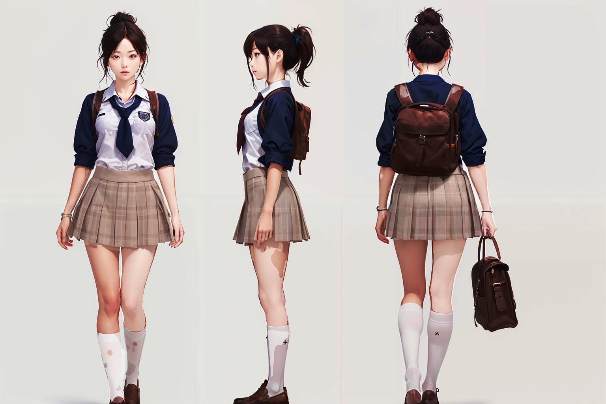

# Team 55 - 3D Reconstruction from Gaussian Repair
## 1 Peoblem Definition
3D modeling finds extensive applications across the movie, gaming, and
architecture sectors. Particularly, the gaming industry has witnessed remarkable
growth over the past decade, resulting in a rising demand for skilled professionals
proficient in programming, design, and operation.Geometric modeling stands as a critical phase in game development, transitioning 2D designs into interactive objects within a 3D environment. The automation of 3D modeling stands to streamline processes, significantly reducing the workload for artists and programmers while enhancing the efficiency of game development. Our project aims to improve current models to generate precise 3D models from 2D design manuscripts and limit the amount of input images to less than 10.

## 2 Related Works
There are several scholars and projects already addressing 3D reconstruction problems in the past few years. Their projects’ scope ranges from multiple images reconstruction to text-to-3d reconstruction. 

**Nerf:**
Neural Radiance Fields (NeRF) is an approach introduced for synthesizing novel views of complex objects by optimizing an underlying continuous volumetric scene function based on a set of input images[^1]. It maps 5D (spatial coordinates and viewing direction) to color and density, enabling high-quality view synthesis[^1]. The novel theoretical insights for this method are using a fully connected network for the above representations and efficient volume rendering techniques to project output into images. It requires short training time to accomplish sound results. However, this approach struggles with handling transparent and reflective object surfaces. Since it models both volume and color, which could potentially result in low-quality surfaces. NeRF's volumetric density-based approach may result in requiring more images and higher network capacity to capture sufficient detail of an object.

(Nerf Pipeline, image credit to https://github.com/bmild/nerf/blob/master/imgs/pipeline.jpg)

- Pros: short training time.
- Cons: In accurate result

**NeuS:**
NeuS is introduced as a neural surface reconstruction method aimed at reconstructing objects and scenes from 2D image inputs with high fidelity[^2]. It stands out among existing neural surface reconstruction approaches by overcoming specific limitations, particularly in handling objects with severe self-occlusion or thin structures without requiring foreground mask supervision[^2]. NeuS combines the advantages of volume rendering used in novel view synthesis approaches like NeRF with the robustness of optimization for complex objects and introduces a new methodology to extract high-quality surfaces from an implicit representation learned through volume rendering. This representation is achieved by treating the surface as the zero-level set of a signed distance function (SDF) and developing a new volume rendering technique to train a neural SDF representation. 

(NeuS's improvement over nerf, image credit to https://lingjie0206.github.io/papers/NeuS/)
- Pros:
1. Accurate Surface Reconstruction: NeuS achieves a high degree of accuracy in reconstructing the surfaces of objects and scenes from 2D image inputs, especially for complex structures and self-occlusions. 
Training Without Mask Supervision: A notable advantage of NeuS is its ability to train without requiring foreground masks. 
2. Training Without Mask Supervision: A notable advantage of NeuS is its ability to train without requiring foreground masks. 

- Cons:
1. Requirement for Multiple Images: NeuS necessitates the use of multiple images (around 30 or more) along with detailed camera information, including the calibration matrix for each image. And the training process is time-consuming.
2. Specific to Each Set of Images: Each trained NeuS model is specific to the set of images it was trained on and cannot be directly extended or applied to other objects or scenes without retraining. 

**Wonder3D:**
Single Image to 3D using Cross-Domain Diffusion (Nov 18, 2023). This study introduces “Wonder3D”. Wonder3D" proposes a novel approach using a cross-domain diffusion model that generates multi-view normal maps and color images, leveraging a multi-view consistency mechanism and a geometry-aware normal fusion algorithm to achieve high-quality, detailed, and efficient single-view 3D reconstruction. Earlier methods used Score Distillation Sampling (SDS) based on 2D diffusion models or directly generated 3D information but faced issues with time efficiency, quality, or detail capture.

(Input image)

- Pros: 
1. Efficiency: Wonder3D can reconstruct highly detailed textured meshes from a single-view image in just 2 to 3 minutes, showcasing a significant advantage in terms of speed and efficiency.[^3]
2. Single Image Requirement: Wonder3D only needs one image to generate 3D models. This simplifies the input requirements and makes 3D reconstruction more accessible.[^3]

- Cons:
1. limitation with Images and Geometries: While efficient, Wonder3D only works with simple images or geometries because of its one-image requirement.
2. Perspective Guesswork: Since it works from a single image, Wonder3D needs to "guess" the perspective of other angles. This could introduce inaccuracies.

**GaussianObject:**
GaussianObject is a novel framework designed to reconstruct high-quality 3D objects from as few as 4 input images, which is based on a technique called Gaussian splatting[^4]. This method significantly outperforms previous state-of-the-art methods in challenging datasets by efficiently handling multi-view consistency and partially omitted or compressed object information with only a minimal set of images. The approach incorporates structure priors in the initial optimization process and employs a Gaussian repair model to enhance the rendering quality, demonstrating its effectiveness across various real-world datasets[^4].

(Pipeline of Gaussian Repair, image credit to https://gaussianobject.github.io/)

- Pros:
1. High-Quality 3D Reconstruction from Sparse Views: GaussianObject is capable of generating detailed and accurate 3D models from as few as four images, significantly reducing the number of required images compared to other methods.
2. Efficient Use of Structure Priors: By incorporating techniques such as visual hull and floater elimination, GaussianObject effectively injects structural priors into the initial optimization process.
3. Fast Processing Time: Despite the high-quality outputs, GaussianObject maintains a relatively fast processing time.

- Cons: 
1. Dependence on Precise Camera Poses: The accuracy of GaussianObject's reconstructions relies on precise camera pose information. This reliance potentially limits the applicability of GaussianObject in everyday scenarios where precise camera metadata might not be available.
2. Popping Artifacts in Extreme Views: The occurrence of popping artifacts, especially under extreme viewpoints, is identified as a limitation that can detract from the visual quality of the reconstructions.
3. Color Shifts in Stable Diffusion VAEs: The VAE component of stable diffusion models, which GaussianObject utilizes, tends to introduce color shifts, particularly noticeable on white backgrounds.

**Other Models**

Visit [Three Studio](https://github.com/threestudio-project/threestudio)

## Proposed Method
### Overview
After comparing different 3D Reconstruction models, we decide to build on top of [GaussianObject](https://github.com/GaussianObject/GaussianObject) to generate 3d meshes since it requires the least number of input images and has result closest to ground truth. 

We limit out input images to scene captured by several fixed angles (front, back, left, right, top and down) to simulate the effect of actual 2d character design. 

Since not all 2d designs have comprehensive view from all 6 sides, we will use some views from the original image set while using models to predict views from other sides. Here's a detailed steps:

1. Use semantic segmentation to segment body parts - head , body, arms, legs, foots

2. Composite original image with mask to generate image of each body parts.

3. Construct model for each part separately based on mask color.

4. Combine each part by reading connectivity information from semantic masks.

5. Adjust body parts ratio by hand.
This input set contains a preview of a character from 3 different angles and we want to generate a mesh with these provided images.

### Contribution
We limit our scope from general 3d reconstruction into human body. In this case we can apply some technique that can improve this task specifically (such as human parts segmenentation). The result generated by this model would be closer to the ground truth than general 3d reconstruction models. Since we are generating models from body parts. We can also store information about skeleton and mesh connectivities. These information can assist artist to do further modification on models as well as helps animators to do rigging and animation works.

### Intuition
Our approach generate 3d meshes by parts, which means we can fine-tune each part separately to find an suitable configuration to acheive the best result of that specific part only. Such configuration, including learning rate, epochs, checkpoints and many other parameters, may vary from one part to another. We believe that fine-tune each part separately will give over all best result.

### Visual
Extract body Segment

Mesh Reconstruction

# Experiment Setup
### Purpose
Our experiment contains two parts: segmentation parts and reconstruction parts. We tried 3 semantic segmentatiion models(ATR Parser, Pascal Parser, LIP Parser) for parsing human bodys with customized number of categories. We finally decide to use ATR Parser due to it's high accuracy and large number of categories. After tuning the model for segmentation, we use our optimal configuration to parse our input image and apply the parsing result to original image to generate the image of specific part only.

In the second part, based on the segmented image, we put them into different pre-trained 3d reconstructio models such as Wonder3D，CRM and Nerf. We measure the quality of 3d reconstructon by calculate square distance of vertex coordiante between generated result and ground truth. For measuring the accuracy of texture mapping, we calculate the difference by captuer the textured model from the same angle as input image and run the same segmentation algorithm to compare the segmentation result.

### Input description
The input data should be 1-3 images of a human character, each image should capture a different angle of the character. The images should have their background removed or have a clear border between human and non-human. Each image is associated with the number of parts to be parsed. Here's an example of our input image (we will use this as an example in the rest of report):

### Desired output description
The segmentation section of our experiment should output a color mask with different colors cover corresping area of input image, each color indicate a specific part of human body.

The 3d reconstruction part should output 6 views of the input image along with normal map.

 
Finally we will use diffusion models to reconstruct 3d meshes based on these maps and the output should be an .obj file contains vertex and face information about mesh.
 

### Metric of success
We will compare the segmentation result of produced image with segmentation result from original image to measure the accuracy of meshes with texture. We compare the squared distance between generate meshes and ground truth to measure the accuracy of mesh.

# Result
The model obtained from our approach is better than naive approach visually, here's an example(left is ours, right is naive approach):
 
The result generated from our approach produced more detailed sculpture of the character, we can clearly see the face, cloth, skirt, arms and legs of the character.

Here's an over view of sematic segmentation result on our dataset:
| Model    | mIou |
| -------- | ------- |
| ATR 7 category  | 85.29% |
| ATR 15 category  | 82.36% |
| LIP | 59.36 %    |
| Pascal    | 71.46%    |
It seems like ATR parser with 7 category produced the highest accuracy, our experiment used this approach in later works.

Here's an example of 3d mesh reconstruction along with textured mesh:

# Discussion
Our final approach is way different from the approach we proposed initially. During our experiment, we gradually add more and more task-specific works, such as body parsing, multiview generation and customized workflow. In the past we thought neural network is a generalized problem that a good model can solve everything but after this experiment we learned that in order to produce accurate result, each problem set should have its task-specific set ups.

# Challenge Encountered
The most difficult part of our experiment is environment setup. Since our model build on top of existing models but different models has different environment requirement, we often encounter version conflicts on tensorflow, pytorch etc. These models also requires large amount of computing resource that exceed the capability of our personal graphics card so we rent server from google colab to run the model.

# Member Contribution

In alphabetical order:
- Yuze Su: leader, task arrangements, trained curtomized GaussianObject, GaussianObject Hyperparameter tuning, data collection, design workflow.
- Xiaoai Zhu: proposal update writing, trained customized Wonder3D, Wonder3D Hyperparameter tuning, Gaussian Repair Parameter tuning
- Xiaoke Wang: proposal update writing, trained customized NeuS, NeuS hyperparameter tuning, mesh refining.

## Reference

[^1]: B. Mildenhall et al., “Nerf: Representing scenes as neural radiance fields for view synthesis,” Computer Vision – ECCV 2020, pp. 405–421, 2020. doi:10.1007/978-3-030-58452-8_24 
[^2]: P. Wang, L. Liu, Y. Liu, C. Theobalt, T. Komura, and W. Wang, “Neus: Learning neural implicit surfaces by volume rendering for multi-view re-
construction,” arXiv preprint arXiv:2106.10689, 2021.
[^3]: X. Long, Y.-C. Guo, C. Lin, Y. Liu, Z. Dou, L. Liu, Y. Ma, S.-H. Zhang,M. Habermann, C. Theobalt, et al., “Wonder3d: Single image to 3d using
cross-domain diffusion,” arXiv preprint arXiv:2310.15008, 2023.
[^4]: C. Yang, S. Li, J. Fang, R. Liang, L. Xie, X. Zhang, W. Shen, and Q. Tian, “Gaussianobject: Just taking four images to get a high-quality 3d object
with gaussian splatting,” 2024.
[^5]: 
[^6]:
